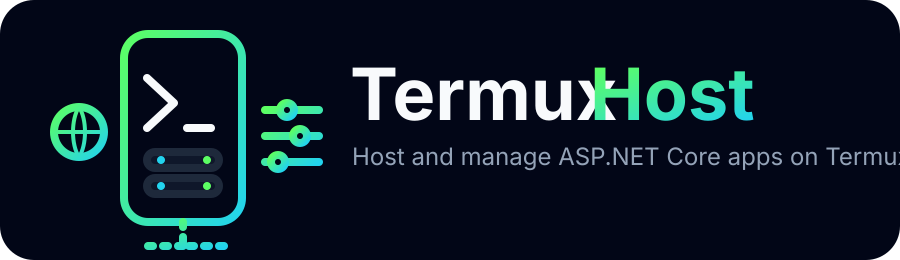
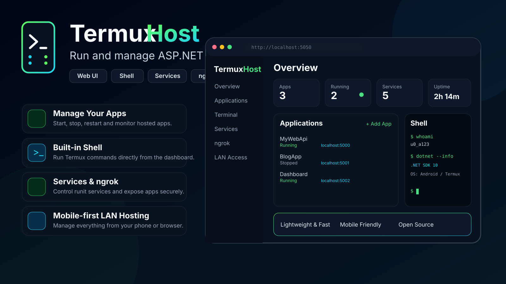

<p align="center">
  
</p>

<p align="center">
  <strong>A mobile-first hosting control panel for running and managing ASP.NET Core apps directly on Termux.</strong>
</p>

<p align="center">
  
</p>

## What TermuxHost does

TermuxHost turns an Android phone running Termux into a lightweight application host with a browser-based control panel.

Current capabilities include:

- Run and manage ASP.NET Core applications on Termux
- Create per-app runit services
- Start, stop and restart hosted applications
- Configure ports and startup DLLs
- Manage environment variables and masked secrets
- Execute Termux shell commands from the web UI
- Control ngrok from the UI
- Set the ngrok auth token, start/stop tunnels and view status/logs
- Access the dashboard and hosted apps over LAN
- Mobile-first responsive Tailwind UI
- Release ZIP based installation and updates
- ARM64/aarch64 Termux smoke testing in GitHub Actions

## Quick install

TermuxHost installs from the latest GitHub Release. The phone does not clone or build this repository.

```bash
curl -fsSL https://raw.githubusercontent.com/dhhieu113pro/termux-host/main/install.sh | bash
```

The installer sets up the required Termux packages, including .NET 10 SDK, Git, GitHub CLI, `termux-services`, and ngrok, then downloads:

```text
termux-host-aarch64.zip
```

from the latest GitHub Release.

After installation, open:

```text
http://<PHONE-IP>:5050
```

On the phone itself:

```text
http://127.0.0.1:5050
```

### Service commands

```bash
sv status termux-host
sv restart termux-host
sv down termux-host
sv up termux-host
```

If `termux-services` was installed for the first time, restart the Termux session once so runit can initialize.

## Hosted applications

Each hosted application gets its own runit service.

Example:

```text
termux-host-app-aistudio
```

TermuxHost can generate service configuration from the application settings entered in the UI:

```text
Name                 AI Studio
Port                 5100
Startup DLL          AIStudio.Api.dll
Working directory    ~/apps/aistudio/current
Environment          Production
```

ASP.NET Core settings can be overridden with environment variables using the standard double-underscore convention:

```text
ConnectionStrings__Default
FeatureFlags__UseNewApi
OpenAI__ApiKey
```

Secrets are masked in normal API/UI responses.

## ngrok

The installer includes the ARM64 ngrok client.

From the TermuxHost UI you can:

- save the ngrok auth token
- start a tunnel for a selected local port
- stop the tunnel
- see running status
- see the public URL
- inspect ngrok logs

You can also use ngrok directly:

```bash
ngrok config add-authtoken <YOUR_TOKEN>
ngrok http 5050
```

## Release layout

Installed versions are kept separately:

```text
~/termux-host/
├── releases/
│   ├── v0.1.0/
│   └── v0.2.0/
├── current -> releases/v0.2.0
└── logs/
```

The runit service always starts the version referenced by `~/termux-host/current`, allowing future updates and rollback without overwriting the active installation in place.

## Creating a release

Push a version tag:

```bash
git tag v0.2.0
git push origin v0.2.0
```

GitHub Actions will:

1. Build the ASP.NET Core application.
2. Create `termux-host-aarch64.zip`.
3. Run a Termux aarch64 container through QEMU.
4. Run the real `install.sh` against the locally built ZIP.
5. Start TermuxHost and verify `http://127.0.0.1:5050` with `curl`.
6. Publish the tested ZIP as the GitHub Release asset.

## Development

```bash
dotnet restore
dotnet run --urls=http://0.0.0.0:5050
```

Then open:

```text
http://127.0.0.1:5050
```

## Roadmap

- In-app update check against GitHub Releases
- One-click update and rollback
- Git clone/pull/deploy for hosted applications
- Live application logs
- File manager
- Interactive PTY terminal with xterm.js
- Deployment history
- Authentication
- HTTPS / reverse proxy support

## Security note

TermuxHost can execute shell commands and control hosted processes. Do not expose the management UI publicly until authentication is enabled. If you use ngrok today, prefer tunneling individual hosted apps rather than the management panel itself.
